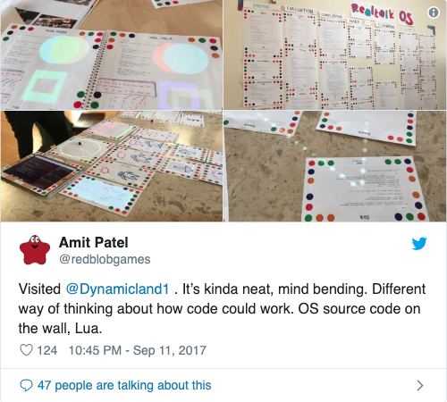
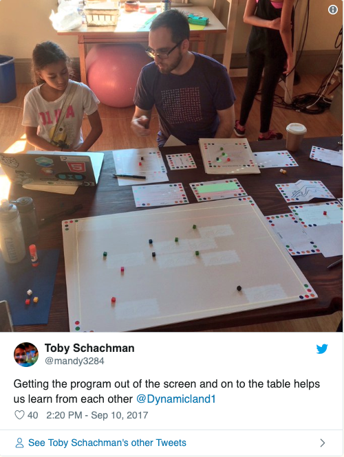

# Dynamicland, 可视空间和设计工坊

从 2017 年 9 月 11 日星期一开始 [Dynamicland](https://twitter.com/dynamicland1) 发布的一系列照片和视频剪辑让我意识到，我可能错过了一个有意思的东西 -- 并且是最佳实践 -- 那就是 Bret Victor 在 2014 年分享的 “可视空间”

下面是一些我尝试总结的片段。（如果你已经熟悉 Dynamicland，这将会有所帮助）

## 一个共享的知识空间

在 2013 年，Bret Victor 在[《关于道格拉斯·恩格尔巴特的一些话》](http://worrydream.com/Engelbart/)中批评了那些忽略格拉斯·恩格尔巴特[《所有演示之母》](http://www.dougengelbart.org/firsts/1968-demo-interactive.html)真正意图的回顾。

从当今计算机系统的角度来看 1968 年的演示，容易忽略恩格尔巴特对 NSL(oN-Line System) 的定位，即从计算机程序员身上开始，作为增强人类智慧的工具。

## 最佳的可视化工具是房间

在 2014 年，Bret Victor 发表了[《可视空间》](http://worrydream.com/SeeingSpaces/)，以对话和漫画的形式阐述了“可视空间”的创意，它就像一个工坊或者创客空间，目的是为了帮助人理解而不是建造。

视频中的对话和漫画的结尾都描述了一个未来实验室样子，在这个实验室中到处都是巨大的显示屏，摄像头和分析仪器，帮助创造者们理解他们正在制作的机器人。

## 文字描述已经过时

也是在 2014 年，Bret Victor 发表了 [《 文字描述已经过时: 通过动态模型阐释和理解》](https://vimeo.com/114252897)，汇总了一系列包括他自己和别人的例子，这其中包括可探索性解释、可交互文档和软件工具，使系统更加直观和易于理解。

## 关于工具

Bret Victor 在 2014 年有一个的谈话分享，我从中理解到：他说到的是工具，当我们都认真地制造出最符合这种工作方式的工具时，一场革命就将到来。

在我上一个主要的个人项目中，我就是这样做的：我首先开发出工具，让我首先可以全面、深入地理解所做的工作。

## Dynamicland

几年之后，我的推特时间线被 Dynamicland 的参与者搞得有些混乱。我花了一分钟才明白我所看到的 Dynamicland，但如果你点击这条推特，就可以很好地理解 Dynamicland：

<a href="https://twitter.com/redblobgames/status/907253802931126272/photo/1?ref_src=twsrc%5Etfw%7Ctwcamp%5Etweetembed%7Ctwterm%5E907253802931126272%7Ctwgr%5E393039363b636f6e74726f6c&ref_url=http%3A%2F%2Fvitor.io%2Fon-dynamicland" rel="some text">]</a>

这个项目起源于 Bret Victor 所在的 Y Combinator HARC 实验室。Dynamicland 是一个允许通过实体对象和交互方式编程的工坊，整个房间就是程序员的 IDE。

但是有另一条推特说道

<a href="https://twitter.com/mandy3284/status/906764328279318528/photo/1?ref_src=twsrc%5Etfw%7Ctwcamp%5Etweetembed%7Ctwterm%5E906764328279318528%7Ctwgr%5E393039363b636f6e74726f6c&ref_url=http%3A%2F%2Fvitor.io%2Fon-dynamicland" rel="some text">]</a>

我在这里引用一下这段话：

> _“把程序从屏幕里搬出来放到桌子上帮助我们互相之间学习”_。

那就不仅仅是把房间作为编程的工具。

房间还是一个促进互相之间相互理解的编程工具。

我认为我错过了一些东西。

## 设计工坊和参与式设计

在 2011 年，Will Evans 发表了一系列的文章，介绍了一个最初源于建筑领域的协作设计、工业设计、无关艺术评论的设计工坊。

- [设计工坊方法简介](https://web.archive.org/web/20111010221154/http://uxmag.com:80/articles/introduction-to-design-studio-methodology)
- [设计工坊的设计](https://web.archive.org/web/20111006040634/http://uxmag.com:80/articles/the-design-of-design-studio)
- [设计工坊和敏捷用户体验：过程和陷阱](https://web.archive.org/web/20111111004917/http://uxmag.com:80/articles/design-studio-and-agile-ux-process-and-pitfalls)
- [自 2011 年 5 月 2 日以来，Will Evans 发布的相簿](https://www.flickr.com/photos/27764576@N06/sets/72157626509819731/)

在像如[产品发掘](http://jpattonassociates.com/design-studio-recipe/)的过程中，设计工作室方法用于促进参与式设计。

在工坊的整个过程中，所有的参与者都在同一个实体空间中工作，他们使用相同的工具，彼此之间共享知识。使用的工具是标记纸和便笺，目的是为了促进彼此之间的理解。

## 也许不是工具的问题

道格拉斯·恩格尔巴特希望增强人类的智慧。他的论文[《增强人类智慧：概念与框架》](http://www.dougengelbart.org/pubs/augment-3906.html)没有探究通过其他人来增强智力，而是将 NSL 作为工具来增强，因为它支持广泛的协作。NSL 的参与者可以在相同的 _虚拟_ 空间内同时工作，使用相同的工具和共享知识。

**文字描述已经过时**是针对工具而言的，但是正如 Bret Victor 在[《关于道格拉斯·恩格尔巴特的一些话》](http://worrydream.com/Engelbart/) 中批判到，这是“当今计算机是针对单用户设计”的产物。在现有的条件约束下，这些是 Bret Victor 能展示给我们的唯一东西。

## 也许是为了促进共同理解

自从 2010 年以来，我一直在运营着设计工坊，我把上面这张图片和这个引述放到了一起。

> _“把程序从屏幕里搬出来放到桌子上帮助我们互相学习”_。

如果可视空间不仅仅是让一个*人*看到内部构造，看到时间，看到各种可能性的工具呢？

如果可视空间应该是让每一个人看到这些事物呢？如果你的所有同事，你的所有朋友，你所有相关人员，都处于同一个空间内，能够看到所有的数据和工具，获取共同的感悟呢？

这不是一个一群人在里面大房间吗？

如果我们可以看到未来的可视空间，一个小机器人和一两个创作者在一起，想象未来的工作坊是挤满了相关人员，或者全是学生，所有人都希望去理解、评价和贡献，或许你有一个理论来解释工坊的方法和参与式设计是如何扩展到工作的各个方面的。

设计工坊已经是一个用于描绘和迭代的可视空间：当你呈现和谈论设计时你可以看到内部；你可以看到随着时间的推移每个迭代都建立在前一个迭代之上；你可以看到各种不同的可能性；

如果可视空间仅仅只是一个工具的话，那么我们只能在原地等待这个世界提供这样的工具。

但是如果可视空间包含了其他人或者*引导性*的话，那么我们我们不仅可以从工作空间中实施流程和开发项目，还可以用仪器探索它，把它们从显示器和服务器中拿出来放到桌子上变成有形的艺术品，我们还能够让人们*参与*进来。

一个可视空间也可以是非技术层面的，就像一个设计工作室，只要它有 3 种可视化属性。采访和汇报可以可视化内部。可记录和重播的语音和图像、记笔记和分析用来可视化时间。场景规划用来可视化概率。

可视空间也可以是技术层面的。我们可以用投影仪和笔记本电脑拼凑出针对个别问题的解决方案，就像 Dynamicland 一样创造编程的共享感知。

Dynamicland 的哪些方面关于编程的，哪些方面是可归纳的具有普适性的？

从学习将东西从竖直的屏幕转到水平面（共享的工作台）是否已经足够？

是否满足前面 3 种可视化的属性，或者是否存在其它的核心属性来促进共享感知？

在你个人的工作中，从何开始做起？

现在是 2017 年 9 月 12 日。感谢您的关注。

## 续

> *更新于 2017 年 10 月 1 日*

感谢所有的评论和转发。

同样感谢  Atlantic 文章 [《即将到来的软件天启日》](https://www.theatlantic.com/technology/archive/2017/09/saving-the-world-from-code/540393/)中的引用：

> 但看到他的谈话最终产生的效果，Bret Victor 大失所望。他后来说道“很多人似乎误解了我所说的话”。当人们开始邀请他参加会议讨论编程工具时，他就知道人们误会了他的意思。他说道“每个人都认为我对编程环境感兴趣”。事实上他真正感兴趣的事让人们如何看见和理解系统，正如他提到“动态行为的视觉表示”。

至少我并不孤单！
